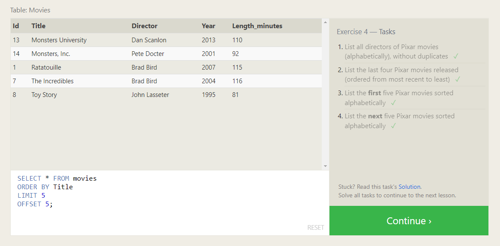
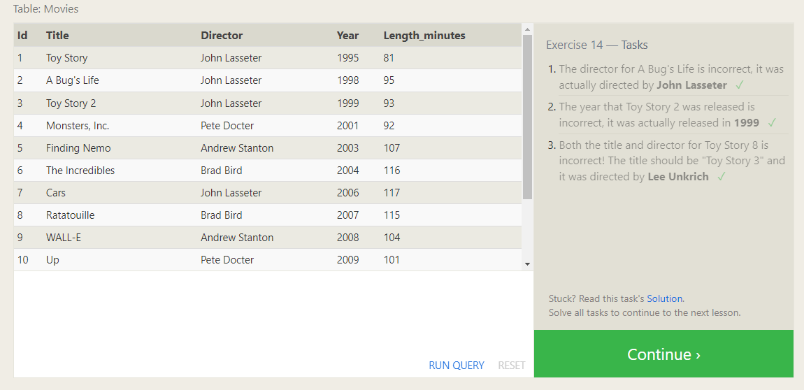

# SQL & relational databases
I have understand SQL through a dedicated online resource, [SQl blot](https://sqlbolt.com/), which has further strengthened my expertise in working with databases and querying data efficiently.    

+ First SQL   
I have learned how to deal with a tables in the database , how to get specific data from it, specific row, column and how to add conditions and other orders to get the specific data you want from tables.

+ Relational Database  
I have learned normalization, primary and foreign keys, and relationships between tables. Understanding the DML and The DDl.

## These Pictures represent the progress at ***SqlBlot*** 

